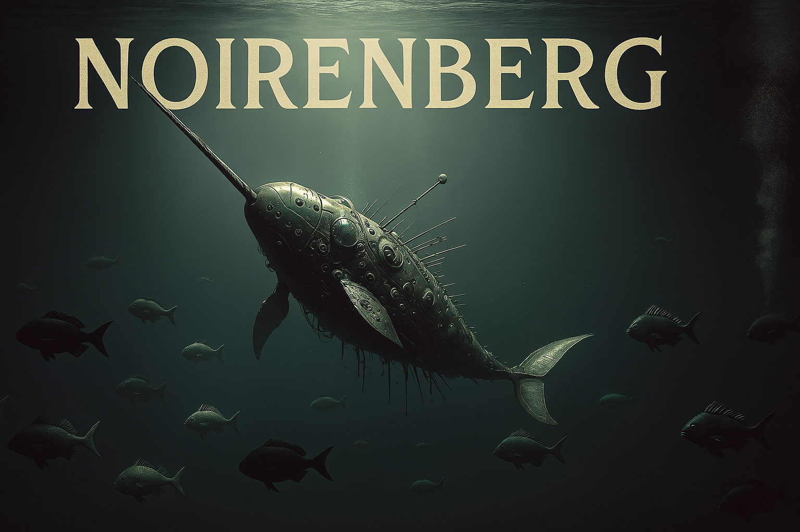

# Noirenberg Codespace 🖥️

This is a a codespace with Noir and Barretenberg. You can use it to start developing Noir programs with two clicks. 

Codespaces are free cloud machines ([ forup to 60 hours a month](https://github.com/features/codespaces)). 

Powered by [devcontainer features](https://github.com/AztecProtocol/devcontainer-feature) you can reuse in any codespace.
